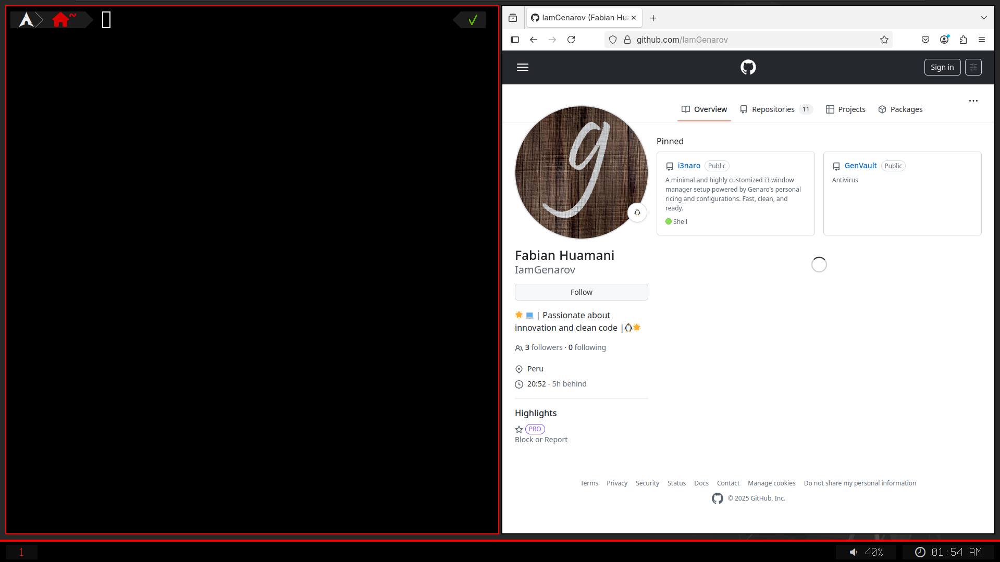

# i3naro - Entorno gráfico rápido y minimalista con i3

<p align="center">
  
</p>


> Un entorno gráfico basado en i3-gaps, con una configuración rápida, limpia y personalizada por GenaroV.

**i3naro** es un entorno de usuario minimalista y altamente personalizado que transforma tu experiencia con [i3 Window Manager](https://i3wm.org/) desde el primer arranque. Está diseñado para entusiastas de Linux que buscan control, rendimiento y estética simple.


---

## 🚀 Características

- ⚙️ Basado en i3-gaps con configuración predefinida
- 🧠 Rofi, Polybar, Picom y Alacritty totalmente integrados
- 💻 Zsh con Powerlevel10k, autosuggestions y syntax highlighting
- 🎨 Tema Dracula, íconos modernos y fuentes Nerd Fonts
- 📁 Configuración modular y sencilla de mantener
- ⚡ Compatible con `startx` o `lightdm` (elige en la instalación)
- 🧩 Scripts de instalación automatizada y estructura limpia
- 🌐 Soporte completo para conexiones de red, multimedia, etc.

---

## 💻 Compatibilidad

> i3naro está pensado para sistemas Arch Linux o distros compatibles con `pacman`.

⚠️ **Nota**: No recomendado para usuarios novatos. Se requiere familiaridad con la terminal y gestión de ventanas en Linux.

---

## 📥 Instalación

1. Clona este repositorio:

```bash
git clone https://github.com/g3nkzn/i3naro.git
cd i3naro
Da permisos al script de instalación:

bash
Copiar
Editar
chmod +x install.sh
Ejecuta el instalador:

bash
Copiar
Editar
./install.sh
Elige entre startx o lightdm según tu preferencia.

📸 Capturas
Próximamente...

📄 Licencia
Este proyecto está bajo la licencia MIT.