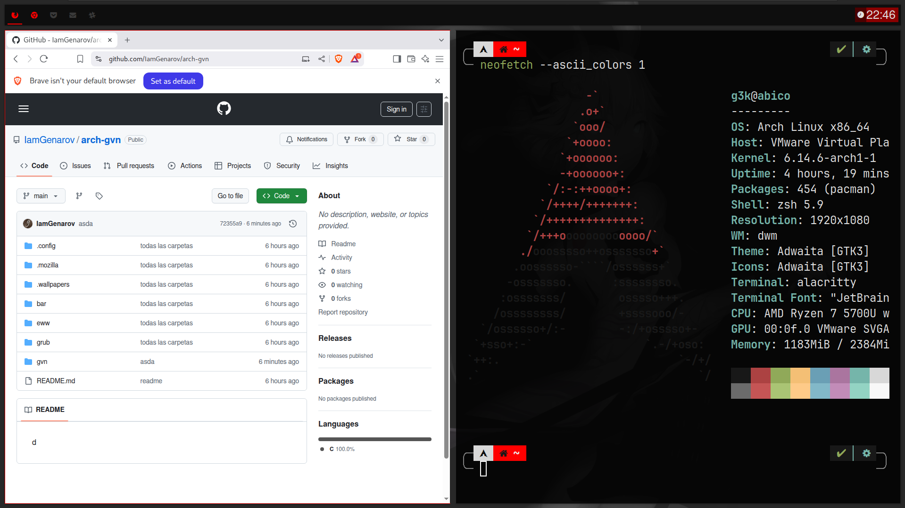

# Arch GVN - Distribución avanzada minimalista

<p align="center">
  
</p>


> Una distribución ligera, segura y rápida, diseñada para usuarios avanzados. Basada en Arch Linux y DWM.

**Arch GVN (GenkzVN)** es un conjunto de scripts que instalan una configuración avanzada y minimalista sobre una base Arch Linux (o cualquier distro compatible con `pacman`). El entorno gráfico está centrado en [DWM](https://dwm.suckless.org/), ofreciendo control total y rendimiento extremo desde el primer arranque.



---

## 🚀 Características

- ⚡ Entorno gráfico minimalista con [DWM](https://dwm.suckless.org/), preconfigurado y funcional desde el primer inicio
- 🎨 Interfaz limpia y visualmente atractiva, con configuraciones propias de usuario
- 🔐 Seguridad: cifrado completo, puertos USB protegidos, hardening con systemd, etc.
- 🧩 Scripts personalizados, hooks de pacman y paquetes locales
- 💾 Soporte para BIOS y UEFI
- 🧭 GRUB propio con tema personalizado
- 📦 Instalación sencilla sobre Arch u otras distros basadas en Linux
- 🧠 Ideal para desarrolladores y entusiastas de sistemas Unix

---

---

## 💻 Compatibilidad

> Arch GVN está pensado para sistemas x86_64 modernos. Aunque fue desarrollado sobre Arch Linux puro, también puede adaptarse fácilmente a distros compatibles (como EndeavourOS, Artix, etc.).

⚠️ **Nota**: No es una distro para principiantes. Se recomienda experiencia previa con la terminal y sistemas Linux.

---

## 📥 Instalación

1. Clona este repositorio:

```bash
git clone https://github.com/g3nkzn/arch-gvn.git
cd arch-gvn
